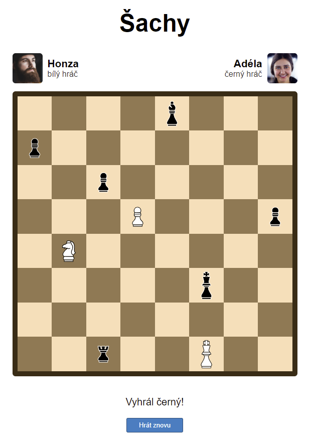
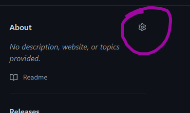
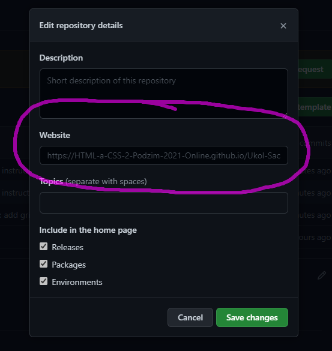
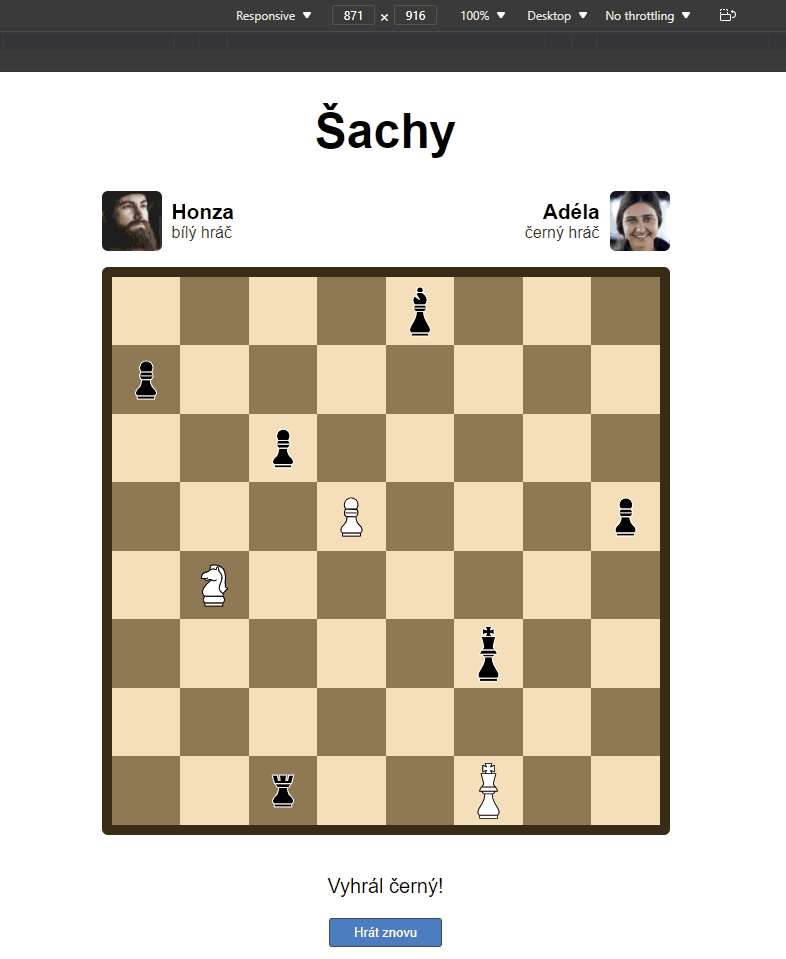

# Úkol: Šachy

Nastyluj stránku podle ukázky níže.

## Výsledek

## Instrukce

- Obrázky figurek, hráčů a šachovnice najdeš ve složce `obrazky`.
- Obsahovým `` obrázkům nezapomeň nastavit atribut `alt`.
- Obrázek šachovnice, mřížky je spíše dekorační. Použij pro něj tedy `background-image`.
- Stránka by měla být responzivní. Omez maximální šířku obsahu na `600px`.
- Pozice figurek nastav pomocí `grid` vlastností.
- Stránku zveřejni na GitHub pages.
- Odkaz na stránku přidej do popisku repozitáře v sekci `About`. Do řádku `Website` vlož adresu, na které je výsledný web hostovaný.

  

  

## Ukázka responzivního chování

## Bonus (dobrovolný)

- Jako obrázek na pozadí šachovnice použij `obrazky/bonus/sachovnice.svg`, který je menší a kvalitnější než `png` varianta.
